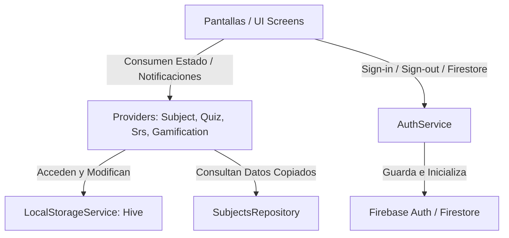

# 🗺️ Mapa de Navegación y Arquitectura del Proyecto — EDUPOL

Este documento sirve como guía para agentes de Inteligencia Artificial (IA) y desarrolladores humanos para comprender la estructura, flujos de datos y diseño del proyecto Flutter **EDUPOL**.

---

## 📂 Estructura de Directorios

```text
/EDUPOL-flutter
├── android/                   # Configuración y código nativo de Android
│   └── app/src/main/
│       └── AndroidManifest.xml # Manifiesto principal (contiene queries de url_launcher)
├── assets/                    # Imágenes estáticas y recursos multimedia
│   ├── images/                # Fondos de pantalla y texturas
│   └── icon.png               # Logotipo oficial del app
├── lib/                       # Código fuente de Dart (Flutter)
│   ├── config/                # Configuraciones globales y constantes
│   │   └── app_config.dart    # WhatsApp, modo demo y Gemini API Key
│   ├── data/                  # Base de datos de preguntas y temas
│   │   ├── library/           # Contenidos estructurados por materia (mat, com, cs, etc.)
│   │   └── repository/        # Repositorio central de consultas estáticas
│   ├── models/                # Estructuras de datos (modelos inmutables serializables)
│   ├── providers/             # Manejadores de Estado reactivos (ChangeNotifiers)
│   ├── screens/               # Pantallas completas de la aplicación (UI)
│   ├── services/              # Lógica de negocio pesada, APIs y almacenamiento local
│   │   └── auth_service.dart  # Flujo de login con Google y control de Firestore
│   ├── widgets/               # Componentes visuales pequeños reutilizables
│   └── main.dart              # Punto de entrada de la aplicación y enrutador (AuthWrapper)
└── pubspec.yaml               # Dependencias de paquetes y recursos externos
```

---

## 🏗️ Arquitectura y Flujo de Datos

EDUPOL utiliza el patrón de diseño **Provider** para la gestión de estado de forma reactiva y el desacoplamiento entre las pantallas y la base de datos estática.



### 1. Gestión de Estado (Providers)
- **`SubjectProvider`**: Sirve como intermediario inmutable entre el repositorio y las pantallas. Expone la lista de materias visibles, selecciona tópicos activos y proporciona copias de seguridad de las preguntas para evitar mutar el repositorio.
- **`QuizProvider`**: Gobierna el estado de las sesiones de quiz en curso (crear sesión, responder pregunta, guardar progreso parcial y finalizar). Calcula estadísticas del subject (`getSubjectStats`).
- **`SrsProvider`**: Enlaza el motor del Repaso Espaciado (`SrsEngine`) con el almacenamiento local y la UI para refrescar los contadores y evaluar las respuestas.
- **`GamificationProvider`**: Acumula el progreso en puntos de experiencia (XP), niveles del postulante y racha de días de estudio consecutivos.

### 2. Capa de Servicios
- **`AuthService`**: Implementa `GoogleSignIn` y `FirebaseAuth`. Consulta en Firestore si el correo del postulante posee el valor `isPaid = true` en `/authorized_users/{correo}`. Si no lo tiene, es bloqueado con el diálogo de WhatsApp en el Login.
- **`LocalStorageService`**: Gestiona el guardado permanente y lectura en memoria rápida a través de `Hive`. Cuenta con una política estricta de vaciado de caché (`_srsCache = null`) en su método `clearAll()` para evitar fugas de memoria.
- **`GeminiService`**: Invoca el modelo de IA de Gemini (`gemini-2.0-flash`) para que el tutor virtual de IA explique y genere trucos memotécnicos de las tarjetas del postulante.

---

## 🧭 Índice de Pantallas (Screens)

| Pantalla | Ruta | Propósito |
| :--- | :--- | :--- |
| `LoginScreen` | *(Root si no Autenticado)* | Pantalla de bienvenida premium con botón de Google y diálogo de compra. |
| `HomeScreen` | `/home` | Menú principal (Simulacros, Estudiar, Repasar, Tarjetas). |
| `SubjectGalleryScreen` | `/gallery` | Muestra la rejilla de materias activas (Matemáticas, Comunicación, etc.). |
| `TopicGalleryScreen` | `/topics` | Lista de temas de una materia con estado de quiz pendiente. |
| `QuizScreen` | `/quiz` | Pantalla de quiz evaluativo con explicaciones conceptuales interactivas. |
| `QuizResultsScreen` | `/quiz-results` | Muestra el puntaje, XP ganado y corrección de respuestas fallidas. |
| `SrsReviewScreen` | `/srs-review` | Sesión de tarjetas de memoria (Active Recall) con repetición espaciada. |
| `SrsMiniQuizScreen` | `/srs-mini-quiz` | Evaluación estricta de 20 preguntas tras la sesión de repaso. |
| `FlashcardsSelectorScreen` | *(Direct)* | Selección de tema para estudiar tarjetas flashcards de memoria. |
| `FlashcardsScreen` | *(Direct)* | Mazo de flashcards interactivas con explicaciones de IA. |
| `ExamScreen` | `/exam` | Simulacro oficial PNP de 100 preguntas cronometrado (3 horas). |
| `ExamResultsScreen` | `/exam-results` | Muestra la nota sobre 20 del simulacro de examen. |
| `SettingsScreen` | `/settings` | Configuración de visibilidad de materias, borrado de progreso y logout. |

---

## 🔐 Configuración y Variables de Entorno

Toda la personalización del app se centraliza en `lib/config/app_config.dart`.
- **Modo Demo**: `AppConfig.isDemoMode` limita las preguntas y el simulacro, habilitando un bypass de login automático para pruebas públicas de usuarios no registrados.
- **WhatsApp de Ventas**: `AppConfig.whatsappNumber` unifica el chat de soporte.
- **Gemini API Key**: Se define de forma segura utilizando variables de compilación de Dart:
  ```dart
  static const String geminiApiKey = String.fromEnvironment('GEMINI_API_KEY', defaultValue: '...');
  ```
  Para compilar con una clave segura personalizada, usa:
  ```bash
  flutter build apk --release --dart-define=GEMINI_API_KEY=TU_API_KEY_AQUI
  ```

---

## 🤖 Guía de Desarrollo para Agentes de IA

Si has sido instanciado para modificar o extender este proyecto, sigue estas **reglas de oro**:
1. **No modifiques el repositorio estático directamente**: Si requieres obtener preguntas o materias, hazlo pasando por `SubjectProvider` o agrega el método correspondiente si no existe.
2. **Usa copias de listas al ordenar**: Nunca llames a `.shuffle()` o `.sort()` sobre las colecciones del repositorio; realiza una copia primero (`List.from(...)`) para prevenir la mutación de los cachés en memoria.
3. **Manejo reactivo de Cierre de Sesión**: Al desloguear al usuario, ejecuta `Navigator.popUntil` al root y luego llama a `signOut()`. El widget `AuthWrapper` en `main.dart` se encargará de cambiar la vista y bloquear la navegación automáticamente.
4. **Logs limpios**: Evita usar `print()`. Utiliza únicamente `debugPrint()` para cumplir con las directrices de optimización en producción.
